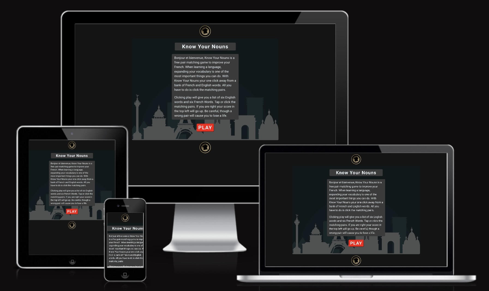
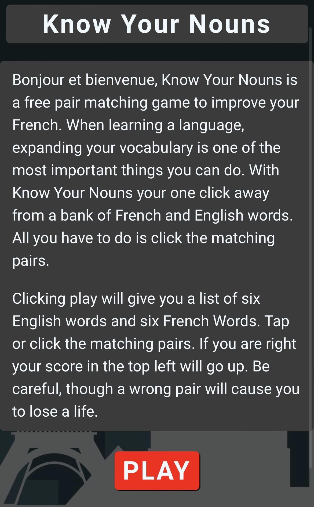
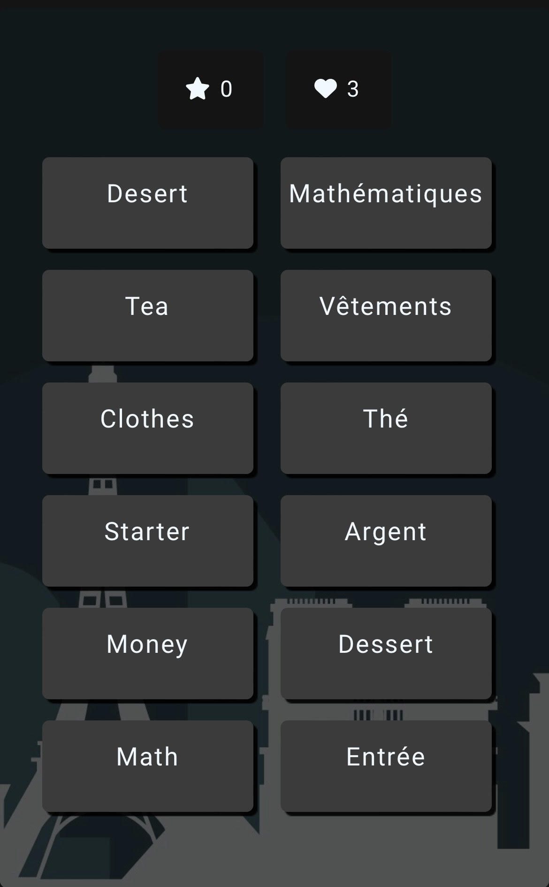
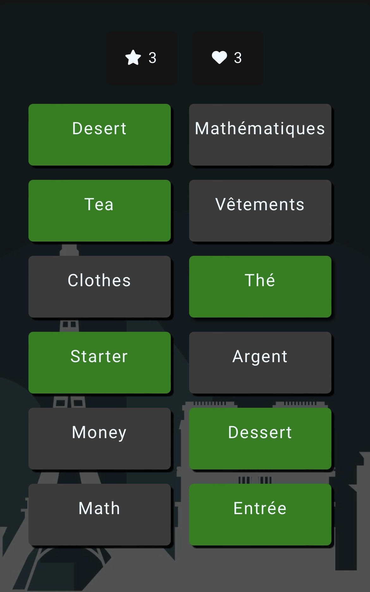
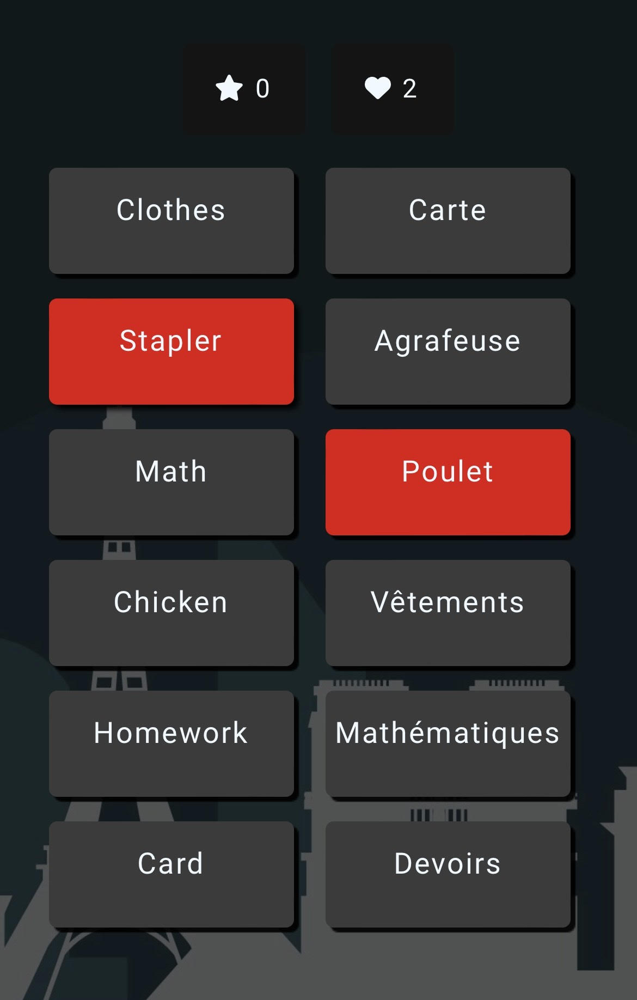

# Know Your Nouns

Know Your Nouns (KYN) is a website designed to help the user increase their French vocabulary. Using JavaScript HTML and CSS KYN will take six random pairs of words from a bank, split them into their English and French version, place the words into random containers and allow the user to try and identify the pairs with clear output the the user which are correct, incorrect and selected.

The main aim of KNY was to create a front end website that demonstrates proficiency in JS HTML and CSS with a particular focus on JS. However, it was also a goal to create a website that would genuinely benefit the creator, and others looking to improve their French vocabulary. Upon  the completion of my diploma I endeavour to return to this site and increase the work bank further.

## Features

### Logo
At the very top of the page is the KYN logo, a dark themes logo keeping with the aesthetic of the whole site. This logo also features at the bottom of the page. On the game page (game.html) the logo serves as a button back to the home page.

### Home Page
When visiting KYN the user is brought initially to the index.html or home page. The home page features a title and content area explaining the
features and rules of the game. Below the content is a vibrant red button that is styled to increase the box shadow when hovered over. This button has the text content "Play" and takes the user to the game page. Beneath the content, title and play button there is a container with a background image of the French skyline; it is separated from the content with grey boxes to increase the ease of reading for the user. A dark theme is prevalent throughout the KYN website and a text colour close to white was chosen to compliment this.

### Game Page
After clicking or pressing the play button the user is taken to game.html. The user is met by 12 words separated into different containers. The six words on the left are English and the Six on the right are French. The title area has also changed for two boxes containing a number and Font Awesome icon. In the top left the score is depicted by a star with the value set to 0 and on the top right there is a heart icon and the value of 3 which is used to show the user the number of lives remaining.

### Correct Answers
The KYN webpage is designed so that it analyses the users input and checks with the original bank of words to see if it is correct. Correct answers will increase the score by one and will be given a new class with a green background to show the user that their input was correct.  

### Incorrect Answers
An input from the user that is incorrect will not increase the score and will instead reduce the number of lives by one. To indicate to the user that their input was incorrect both words will highlight red for 1 second before returning to the normal grey.

## Testing
Testing and validation is one of the most important aspects of software development. I have used the W3C HTML, CSS and JS Hint validators to check the code in this project.

### W3C HTML Validator
The W3 validator was used to check the HTML of this website and responded with no errors.

https://validator.w3.org/nu/#textarea

### W3c CSS Validator
The W3 validator was used to check the CSS of this website and responded with no errors.

https://jigsaw.w3.org/css-validator/validator

### JS Hint Validator
JS Hint was used to check the JS code written in this project. A number of advisories were returned but no critical faults.

https://jshint.com/

### LightHouse Report
The LightHouse Report is a test that can be used on webpages and is accessed through the Chrome developers tools. The report provides the developer with a score out of 100 in the following categories:
<ul>
    <li>Performance</li>
    <li>Accessibility</li>
    <li>Best Practices</li>
    <li>SEO</li>
</ul>

The index.html page scores 92, 100, 96 and 100 respectively. The game.html page scores 81, 100, 100, 100. Accessibility is of key importance in any modern website. The KYN site scores maximum on accessibility.

## Bugs
Whilst every effort has been made to make the KYN site as bug free as possible there still remain a couple of small issues. Whilst being used as intended the site works very well with no glaring errors. However, two issues have been identified labelled as Multiple Selections and Repeat Incorrect. The following two paragraphs will explain these in detail.

### Multiple Selections
If the user selects more than one word from the same side without checking if that word was correct or incorrect then it may appear that multiple items have been selected from the same side. This results in an unnecessary loss of lives or an increase to the score.

### Repeat Incorrect
If the user continues to press the same two words that are incorrect after already being notified that these are not correct. The red display animation will not trigger.

## Deployment
This site has been deployed using GitHub and is available at https://p-worthington.github.io/know-your-nouns-portfolio-project/index.html.

Deployment occurred early in the development of the KYN site in order to fix any bugs which were not visible using the local port. One such bug was noticed where incorrect file paths were used on the game.html page which resulted in there being no CSS or JS on the page. A quick alteration of the filepath rectified this error.

### References
It is important to reference pieces of code used in this project from other sources. Two small functions were used to and are properly referenced below and within the JS file itself.

### Fisher-Yates Shuffle
The <code>shuffle()</code> function was taken from https://stackoverflow.com/questions/2450954/how-to-randomize-shuffle-a-javascript-array and researched on https://en.wikipedia.org/wiki/Fisher%E2%80%93Yates_shuffle.

This function was paramount in the development of KYN. The ability to shuffle arrays made the game truly dynamic and random to the end user.

### Number Finder
The <code>numberFinder()</code> function was taken from https://www.geeksforgeeks.org/extract-a-number-from-a-string-using-javascript/

It is used to extract numbers from a given string. This was particularly important when returning the game to its base state allowing for reuse.
