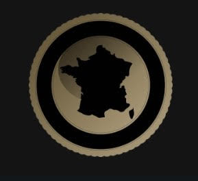

# Know Your Nouns 

Know Your Nouns (KYN) is a website designed to help the user increase their french vocabularly. Using JavaScript HTML and CSS KYN will take six random pairs of words from a bank split them into their English and French version place the words into random containers and allow the user to try and identify the pairs with clear output the the user which are corrct, incorrect and selected. 

The main aim of KNY was to create a front end website that demonstrates proficiency in JS HTML and CSS with a particular focus on JS. However, it was also a goal to create a wesbite that would genuinely benefit the creator, and others looking to improve their French voculabulary.

## Features 

### Logo
At the very top of the page is the KYN logo a dark themes logo keeping with the asthetic of the whole site. This logo also features at the bottom of the page. On the game page (game.html) the logo serves as a button back to the home page. 

### Home Page 
When visiting KYN the user is brought initially to the index.html or home page. The home page features a title and content area explaining the
features and rules of the game. Below the content is a vibrant red button that is styled to increase the box shadow when hovered over. This button has the text content "Play" and takes the user to the game page. Beneath the content, title and play button there is a container with a background image of the French skyline it is separated from the content with grey boxes to increase the ease of reading for the user. A dark theme is prevelant throughout the KYN website and a text colour close to white was chosen to compliment this. 

### Game Page 
After clicking or pressing the play button the user is taken to game.html. The user is met by 12 words separated into different containers. The six words on the left are English and the Six on the right are French. The title area has also changed for two boxes containing a number and Font Awesome icon. In the top left the score is depicted by a star with the value set to 0 and the top right there is a heart icon and the value of 3 which is used to show the user the number of lives remaining. 

### Correct Answers 
The KYN webpage is designed so that in analyses the users input and checks with the origional bank of words to see if it correct. Correct answers will increase the score by one and will be given a new class with a green background to show the user that their input was correct.  

### Incorrect Answers 
An input from the user that is incorrect will not increase the score and will instead reduce the number of lives by one. To indicate to the user that their input was incorrect both words will highlight red for 1 second before returning to the normal grey. 

## Testing 

### W3C HTML Validator
https://validator.w3.org/nu/#textarea

### W3c CSS Validator 
https://jigsaw.w3.org/css-validator/validator

### JS Hint Validator 
https://jshint.com/

### LighHouse Validator 

## Bugs 

## Deployment 

### References 

### Fisher-Yates Shuffle 

### Number Finder